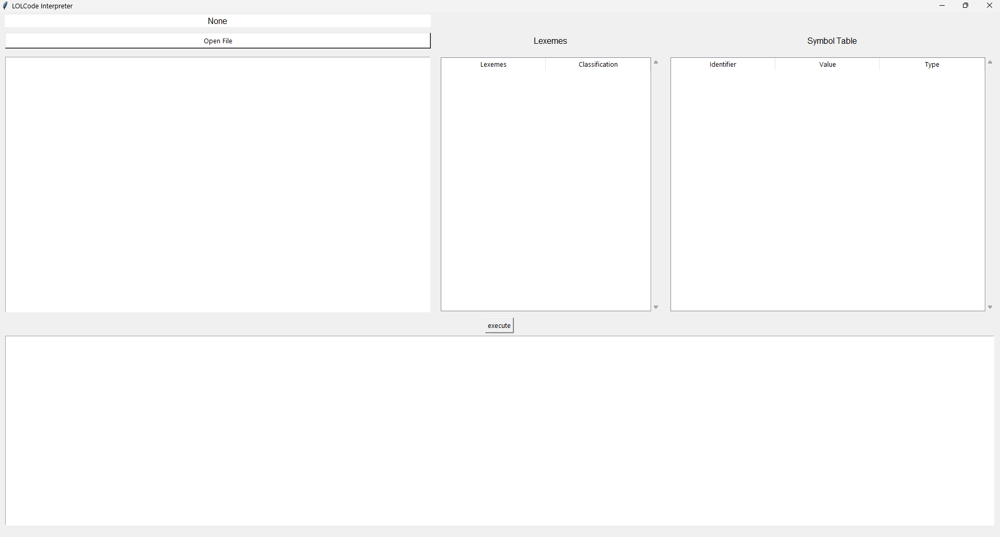
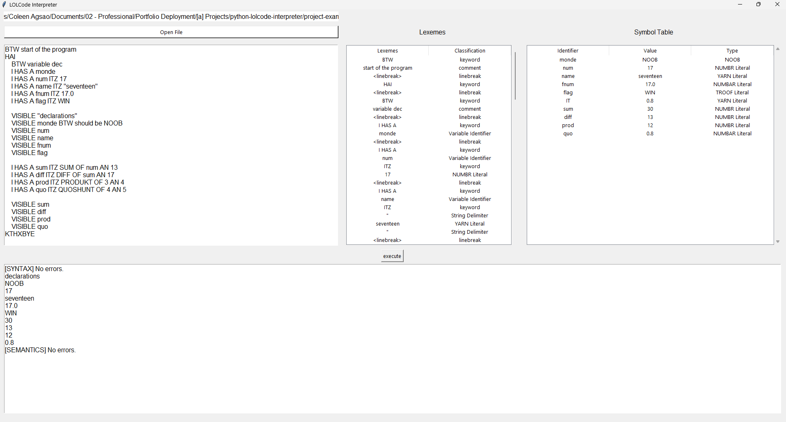

# LOLCODE Intepreter

## Description
This is a Python-based interpreter of LOLCODE. This includes lexical, syntax, and semantics analyzer.

## Technologies Used

## Preparation
1. Make sure Python and `pip` is preinstalled on your system.
	- Type the following command to check if already installed:
		- ` python --version`
		- `pip -V`
	- If not yet installed, you may grab the latest version here: https://www.python.org/downloads/
2. Install Tkinter
	- Tkinter can be installed using pip. Type the command in the command prompt to install Tkinter.
		- `pip install tk`

### Running
1. In order to run the program, use the command `python main.py` or `py main.py`.
2. The LOLCode Interpreter has the following parts:
	- File explorer. This allows you to  select a `.lol` file to run. Once selected, the contents will be loaded to the text editor.
	- Text editor. This lets you view the code you want to run. This is also editable if  you need to add changes before you run the code.
	- Lexemes Table. This displays al the lexemes in your code after you press the execute button.
	- Symbol Table. This displays the symbol table of your code after you press the execute button.
	- Execute Button. This runs the code from the text editor, which in return also returns the lexeme table and symbol table.
	- Console.  This displays all of the user output.
	- Pop out Inbox. Everytime the code needs input from user, a dialog box will appear. 

## Screenshots

*Screenshot of the LOLCode Interpreter*

*Screenshot of Result after importing lolcode-imports/01_variables.lol*

### Authors
- Andre Tuazon
- Coleen Therese Agsao

### Additional Notes
This is an academic project part of CMSC 124 22-23 in UPLB.

